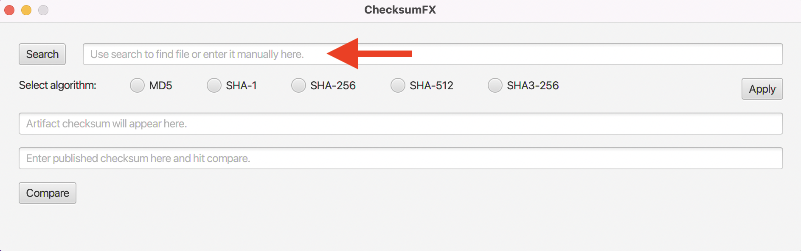
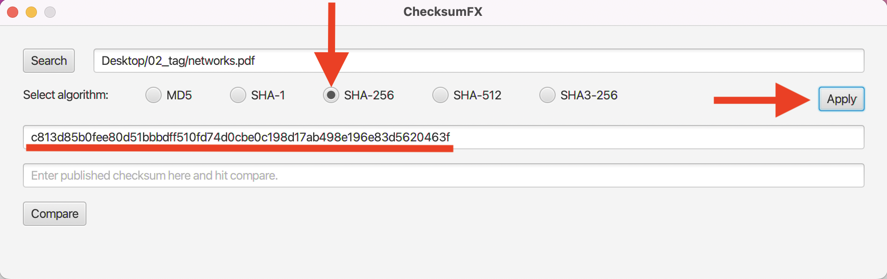
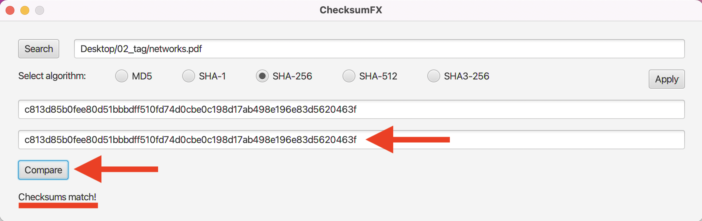
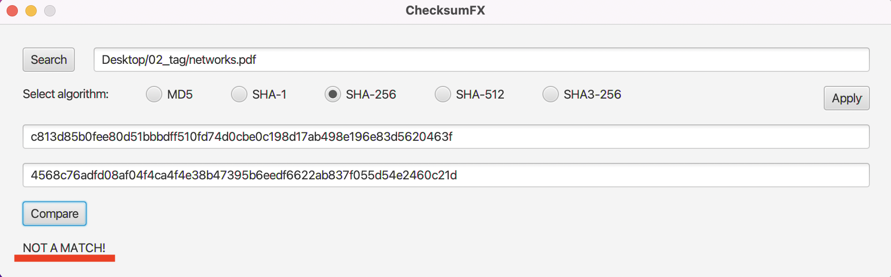

# ChecksumFX

ChecksumFX is a utility intended to calculate the checksums of downloaded files and compare the results with published checksums.

Use the "Search" button to locate a file or enter the file path manually:
  

  

Select the appropriate hash algorithm and press the "Apply" button. The result appears as indicated:
  

  

Copy or enter the published checksum value and press the "Compare" button. The result is either a match ...
  

  

... or not.
  
